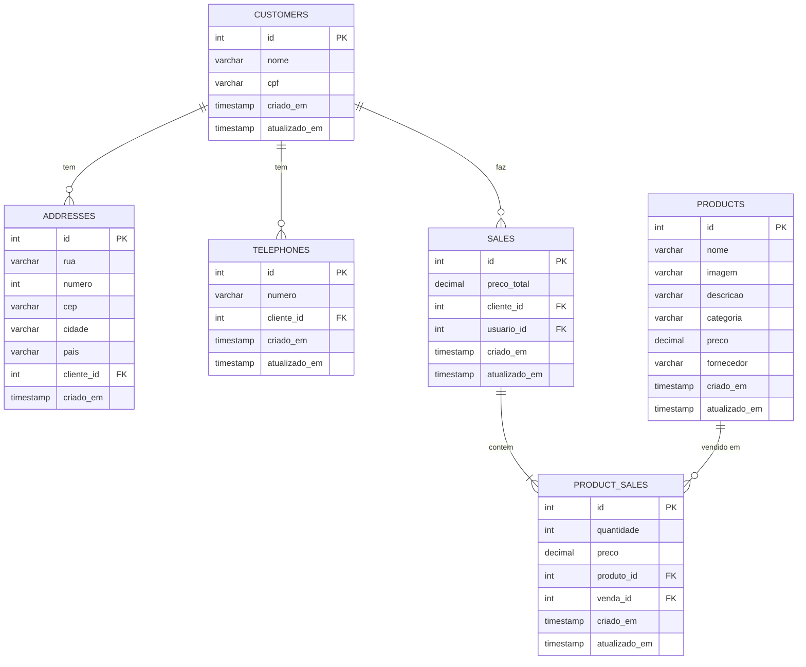

[TYPESCRIPT__BADGE]: https://img.shields.io/badge/typescript-D4FAFF?style=for-the-badge&logo=typescript
[ADONIS__BADGE]: https://img.shields.io/badge/adonisjs-%23220052.svg?style=for-the-badge&logo=adonisjs&logoColor=white
[MYSQL__BADGE]: https://img.shields.io/badge/mysql-4479A1.svg?style=for-the-badge&logo=mysql&logoColor=white
[Docker__BADGE]: https://img.shields.io/badge/docker-%230db7ed.svg?style=for-the-badge&logo=docker&logoColor=white
[JWT__BADGE]: https://img.shields.io/badge/JWT-black?style=for-the-badge&logo=JSON%20web%20tokens

<h1 align="center" style="font-weight: bold;" id="top">Teste Técnico Gerenciamento de Vendas 💻</h1>

<h1 align="center">

  <span>![Adonis][ADONIS__BADGE]</span>
  <span>![Typescript][TYPESCRIPT__BADGE]</span>
  <span>![JWT][JWT__BADGE]</span>
  <span>![MySQL][MYSQL__BADGE]</span>
  <span>![Docker][Docker__BADGE]</span>
</h1>

<p align="center">
  <a href="#about">Sobre o Projeto</a> •
  <a href="#tech">Tecnologias Utilizadas</a> •
  <a href="#started">Como Executar</a> •
  <a href="#routes">Rotas da Aplicação</a> •
  <a href="#author">Autor</a>
</p>

<h2 id="about">📌 Sobre o Projeto</h2>

O Teste Técnico Back-end BeTalent é uma API para gerenciamento de vendas, desenvolvida com o framework AdonisJS. A aplicação permite que usuários autenticados manipulem informações de clientes e produtos, incluindo criação, listagem, edição e deleção. Além disso, permite o registro de compras feitas por clientes, com informações detalhadas dos produtos e suas quantidades.

## Modelo conceitual

O modelo conceitual abaixo representa as principais entidades e seus relacionamentos na API. Além das entidades apresentadas, existe também a entidade Usuário por onde é feito a autenticação para acessar rotas protegidas utilizando JWT.



[Voltar ao Início](#top)

<br>

<h2 id="tech">🖥️ Tecnologias Utilizadas</h2>

### Back-end

- [TypeScript](https://github.com/microsoft/TypeScript)
- [Adonis](https://adonisjs.com/)
- [JWT](https://jwt.io/)
- [Lucid](https://docs.adonisjs.com/guides/database/lucid)
- [Japa](https://japa.dev/docs/introduction)
- [Sinon](https://github.com/sinonjs/sinon)

### Banco de Dados

- [MySQL](https://www.mysql.com/)

[Voltar ao Início](#top)

<br>

<h2 id="started">🚀 Como Executar</h2>

### Pre-requisitos

Os pré-requisitos para rodar localmente o projeto são:

- [NodeJS](https://github.com/nodejs/nodejs.org) >= 20.6
- [MySQL](https://www.mysql.com/)

O projeto também pode ser executado por containers, sendo assim os pré-requisitos são:

- [Docker](https://www.docker.com/)

### Cloning

Para clonar o projeto, abra o terminal e execute o seguinte comando:

```bash
# clonar repositório
git clone git@github.com:SilmarNascimento/beMobile-api.git
```

### Executar o Projeto Localmente

Antes de iniciar o backend, é necessário subir o banco de dados MySQL localmente. Se você já tem o MySQL instalado, inicie o serviço e crie o banco de dados necessário para o projeto. Se preferir, pode usar o Docker para subir o banco rapidamente. Certifique-se de que o banco está rodando na porta `3306` e guarde as credenciais para configurar o backend.

Após iniciar o serviço de banco de dados, instale as dependências do backend executando os seguintes comandos:

```bash
# entrar na pasta raiz do projeto backend
cd beMobile-api

# executar o projeto
npm install
```

Como a aplicação precisa se conectar a um banco de dados, será necessário configurar as credenciais corretas no arquivo `.env`. Crie um arquivo `.env` na raiz do projeto, usando o `.env.example` como base para fornecer o valor das variáveis `DB_HOST`, `DB_USER`, `DB_PASSWORD` e `DB_DATABASE` com seus valores reais:

```bash
#.env

TZ=UTC
PORT=3333
HOST=localhost
LOG_LEVEL=info
APP_KEY=pRD45ao_jypGcua3fws9iD8IzknoxCKj
NODE_ENV=development

#variáveis de ambiente para conexão com o banco de dados
DB_HOST= # IP do Host do MYSQL
DB_PORT=3306 # (A porta 3306 é a porta padrão do MySQL)
DB_USER= #Usuário
DB_PASSWORD= #Password do usuário
DB_DATABASE= #Nome do Banco de dados
```

(Opcional) Para rodar os testes, crie um arquivo `.env.test` na raiz do projeto:

```bash
#.env.test

TZ=UTC
PORT=3333
HOST=localhost
LOG_LEVEL=info
APP_KEY=pRD45ao_jypGcua3fws9iD8IzknoxCKj
NODE_ENV=test

#variáveis de ambiente para conexão com o banco de dados
DB_HOST= # IP do Host do MYSQL de teste 
DB_PORT=3306 # (A porta 3306 é a porta padrão do MySQL)
DB_USER= #Usuário
DB_PASSWORD= #Password do usuário
DB_DATABASE= #Nome do Banco de dados
```

Após a configuração das variáveis de ambiente para conexão com o banco de dados, utilize o comando abaixo para executar as migrations do projeto:

```bash
# entrar na pasta raiz do projeto back end
node ace migration:run
```

A aplicação backend pode ser executada usando o seguinte comando:

```bash
# subir a aplicação backend
npm run dev
```

Esse comando irá iniciar o servidor da aplicação backend. Por padrão, ele estará disponível em <http://localhost:3333>.

### Executar o Projeto com Docker

Caso queira executar o projeto usando docker, após clonar o projeto, abra o arquivo `docker-compose.yaml` na raiz do projeto e edite as variáveis de ambiente no serviço de backend para a conexão com o banco de dados. Após a configuração das variáveis de ambiente, abra o terminal e execute as instruções abaixo:

```bash
# entrar na pasta raiz do projeto e executar o comando docker
cd beMobile-api

docker-compose up -d
```

Esse comando irá iniciar o servidor da aplicação backend. Por padrão, ele estará disponível em <http://localhost:3333>.

[Voltar ao Início](#top)

<br>

<h2 id="routes">📍 Rotas da Aplicação</h2>

 As rotas da aplicação podem ser visualizadas na tabela abaixo. Para interagir com a aplicação, podemos usar um cliente HTTP como Insomnia ou ThunderClient. Além disso, a aplicação possui documentação Swagger para facilitar o seu uso.
Ao subir a aplicação basta acessar o endereço `localhost:3333/docs` para ter acesso à documentação swagger da aplicação

| Método    | URL                             | Middleware | Descrição                                                                                                                         |
|-----------|---------------------------------|------------|-----------------------------------------------------------------------------------------------------------------------------------|
| `GET`     | <kbd>/swagger</kbd>             | -          | endpoint para acessar a documentação Swagger da API                                                                               |
| `GET`     | <kbd>/docs</kbd>                | -          | endpoint para acessar a documentação da API                                                                                       |
| `POST`    | <kbd>/api/register</kbd>        | -          | Registra um novo usuário                                                                                                          |
| `POST`    | <kbd>/api/login</kbd>           | -          | Autentica um usuário e retorna um token JWT                                                                                       |
| `GET`     | <kbd>/api/customers</kbd>       | <kbd>auth</kbd> | Retorna uma lista de todos os clientes                                                                                           |
| `GET`     | <kbd>/api/customers/:id</kbd>   | <kbd>auth</kbd> | Retorna os detalhes de um cliente específico, incluindo endereço, telefone e vendas associadas. Query parameters opcionais year e month para filtrar as vendas associadas ao cliente |
| `POST`    | <kbd>/api/customers</kbd>       | <kbd>auth</kbd> | Cria um novo cliente                                                                                                              |
| `PUT`     | <kbd>/api/customers/:id</kbd>   | <kbd>auth</kbd> | Atualiza os detalhes de um cliente específico                                                                                     |
| `DELETE`  | <kbd>/api/customers/:id</kbd>   | <kbd>auth</kbd> | Exclui um cliente específico                                                                                                      |
| `GET`     | <kbd>/api/products</kbd>        | <kbd>auth</kbd> | Retorna uma lista de todos os produtos que não foram excluídos (soft delete)                                                     |
| `GET`     | <kbd>/api/products/:id</kbd>    | <kbd>auth</kbd> | Retorna os detalhes de um produto específico, desde que não tenha sido excluído (soft delete)                                     |
| `POST`    | <kbd>/api/products</kbd>        | <kbd>auth</kbd> | Cria um novo produto                                                                                                              |
| `PUT`     | <kbd>/api/products/:id</kbd>    | <kbd>auth</kbd> | Atualiza os detalhes de um produto específico                                                                                     |
| `DELETE`  | <kbd>/api/products/:id</kbd>    | <kbd>auth</kbd> | Exclui um produto específico (soft delete)                                                                                        |
| `POST`    | <kbd>/api/sales</kbd>           | <kbd>auth</kbd> | Cria uma nova venda associada a um cliente existente, contendo uma lista de produtos e suas respectivas quantidades               |

<br>

Abaixo está uma descrição detalhada de cada rota disponível na API, incluindo os métodos HTTP, URLs, parâmetros esperados e exemplos de requisições e respostas.

[Voltar ao Início](#top)

<br>

<h2 id="auth">Autenticação</h2>

As únicas rotas desprotegidas da aplicação são as rotas de documentação do swagger e de registro e login de usuários. Portanto, para um usuário conseguir interagir com as outras rotas da aplicação ele deve estar logado e com um token JWT válido.

### POST /api/register

Registra um novo usuário

**Parâmetros:**

- fullName (string, obrigatório): Nome completo do usuário. Deve ter pelo menos 3 caracteres.
- email (string, obrigatório): Email do usuário. Deve ser um email válido.
- password (string, obrigatório): Senha do usuário. Deve ter pelo menos 3 caracteres.

**Validação:**
Os parâmetros são validados usando o 'signUpValidator'

```bash
signUpValidator = vine.compile(
  vine.object({
    fullName: vine.string().trim().minLength(3),
    email: vine.string().email().normalizeEmail(),
    password: vine.string().minLength(3),
  })
)
```

**Exemplo de requisição:**

```bash
POST /api/register
Content-Type: application/json

{
  "fullName": "New user",
  "email": "new.user@example.com",
  "password": "secret123"
}
```

**Exemplo de Resposta:**

```bash
201 Created
Content-Type: application/json

{
  "id": 1,
  "fullName": "New user",
  "email": "new.user@example.com",
  "createdAt": "2024-08-05T10:00:00.000Z",
  "updatedAt": "2024-08-05T10:00:00.000Z"
}
```

**Possíveis Erros:**

- 409 Conflict: Usuário já registrado.

```bash
409 Conflict
Content-Type: application/json

{
  "message": "User already registered"
}
```

[Voltar à Autenticação](#auth)

<br>

### POST /api/login

Autentica um usuário e retorna um token JWT.

**Parâmetros:**

- email (string, obrigatório): Email do usuário. Deve ser um email válido.
- password (string, obrigatório): Senha do usuário. Deve ter pelo menos 3 caracteres.

**Validação:**
Os parâmetros são validados usando o 'loginValidator'

```bash
loginValidator = vine.compile(
  vine.object({
    email: vine.string().email().normalizeEmail(),
    password: vine.string().minLength(3),
  })
)
```

**Exemplo de requisição:**

```bash
POST /api/login
Content-Type: application/json

{
  "email": "new.user@example.com",
  "password": "secret123"
}
```

**Exemplo de Resposta:**

```bash
200 Ok
Content-Type: application/json

{
  "type": "bearer",
  "token": "TokenJWT",
}
```

**Possíveis Erros:**

- 401 Unauthorized: Credenciais inválidas.

```bash
401 Unauthorized
Content-Type: application/json

{
  "message": "Invalid credentials"
}
```

[Voltar à Autenticação](#auth)

<br>

<h2 id="route-customers">Rotas para o recurso de clientes (/api/customers)</h2>

### GET /api/customers

Retorna uma lista de todos os clientes.

**Exemplo de requisição:**

```bash
GET /api/customers
Authorization: Bearer YOUR_JWT_TOKEN_HERE
```

**Exemplo de Resposta:**

```bash
200 OK
Content-Type: application/json

[
  {
    "id": 1,
    "name": "Username",
    "cpf": "12345678901",
    "address": {
      "street": "Main St",
      "number": 100,
      "zipCode": "12345",
      "city": "Springfield",
      "state": "IL",
      "country": "USA"
    },
    "telephone": {
      "number": "1234567890"
    }
  },
  ...
]
```

[Voltar à Rota de Recursos de Clientes](#route-customers)

<br>

### GET /api/customers/:id

Retorna os detalhes de um cliente específico, incluindo endereço, telefone e vendas associadas. Essa rota ainda aceita query parameters year e month para filtrar as vendas associadas ao cliente.

**Parâmetros:**

- id (number, obrigatório): ID do cliente.
- Query Parameters:
  - year (number, opcional): Ano para filtrar as vendas.
  - month (number, opcional): Mês para filtrar as vendas.

**Exemplo de requisição:**

```bash
GET /api/customers/1
Authorization: Bearer YOUR_JWT_TOKEN_HERE

GET /api/customers/1?year=2024&month=8
Authorization: Bearer YOUR_JWT_TOKEN_HERE
```

**Exemplo de Resposta:**

```bash
200 OK
Content-Type: application/json

{
  "id": 1,
  "name": "Username",
  "cpf": "12345678901",
  "address": {
    "street": "Main St",
    "number": 100,
    "zipCode": "12345",
    "city": "Springfield",
    "state": "IL",
    "country": "USA"
  },
  "telephone": {
    "number": "1234567890"
  },
  "sales": [
    {
      "id": 1,
      "quantity": 2,
      "price": "21.00",
      "productId": 2,
      "saleId": 1,
      "createdAt": "2024-08-01T14:53:47.000+00:00",
      "updatedAt": "2024-08-01T14:53:47.000+00:00",
      "product": {
        "id": 2,
        "productName": "shampoo",
        "image": "url_imagem_shampoo",
        "description": "produto para o cabelos secos",
        "category": "produto de beleza",
        "brand": "Seda",
        "price": "21.00",
        "supplier": "Farmácia",
        "status": "available",
        "createdAt": "2024-08-01T01:59:58.000+00:00",
        "updatedAt": "2024-08-01T02:50:41.000+00:00"
      }
    }
  ]
}
```

**Possíveis Erros:**

- 404 Not Found: Cliente não encontrado com o Id fornecido.

```bash
404 Not Found
Content-Type: application/json

{
  "message": "Row not found"
}
```

[Voltar à Rota de Recursos de Clientes](#route-customers)

<br>

### POST /api/customers

Cria um novo cliente.

**Parâmetros:**

- name (string, obrigatório): Nome do cliente. Deve ter pelo menos 3 caracteres.
- cpf (string, obrigatório): CPF do cliente. Deve ter exatamente 11 caracteres.
- address (object, obrigatório):
  - street (string, obrigatório): Rua.
  - number (number, opcional): Número.
  - zipCode (string, obrigatório): Código postal.
  - city (string, obrigatório): Cidade.
  - state (string, obrigatório): Estado.
  - country (string, obrigatório): País.
- telephone (object, obrigatório):
  - number (string, obrigatório): Número de telefone.

**Validação:**
Os parâmetros são validados usando o 'createCustomerValidator'

```bash
createCustomerValidator = vine.compile(
  vine.object({
    name: vine.string().trim().minLength(3),
    cpf: vine.string().fixedLength(11),
    address: vine.object({
      street: vine.string(),
      number: vine.number().optional(),
      zipCode: vine.string(),
      city: vine.string(),
      state: vine.string(),
      country: vine.string(),
    }),
    telephone: vine.object({
      number: vine.string(),
    }),
  })
)
```

**Exemplo de requisição:**

```bash
POST /api/customers
Authorization: Bearer YOUR_JWT_TOKEN_HERE
Content-Type: application/json

{
  "name": "Username",
  "cpf": "12345678901",
  "address": {
    "street": "Main St",
    "number": 100,
    "zipCode": "12345",
    "city": "Springfield",
    "state": "IL",
    "country": "USA"
  },
  "telephone": {
    "number": "1234567890"
  }
}
```

**Exemplo de Resposta:**

```bash
201 Created
Content-Type: application/json

{
  "id": 1,
  "name": "Username",
  "cpf": "12345678901",
  "address": {
    "street": "Main St",
    "number": 100,
    "zipCode": "12345",
    "city": "Springfield",
    "state": "IL",
    "country": "USA"
  },
  "telephone": {
    "number": "1234567890"
  }
}
```

**Possíveis Erros:**

- 400 Bad Request: CPF já registrado.

```bash
400 Bad Request
Content-Type: application/json

{
  "message": "Cpf already registered"
}
```

[Voltar à Rota de Recursos de Clientes](#route-customers)

<br>

### PUT /api/customers/:id

Atualiza os detalhes de um cliente específico.

**Parâmetros:**

- id (number, obrigatório): ID do cliente.
- name (string, opcional): Nome do cliente. Deve ter pelo menos 3 caracteres.
- cpf (string, opcional): CPF do cliente. Deve ter exatamente 11 caracteres.
- address (object, opcional):
  - street (string, opcional): Rua.
  - number (number, opcional): Número.
  - zipCode (string, opcional): Código postal.
  - city (string, opcional): Cidade.
  - state (string, opcional): Estado.
  - country (string, opcional): País.
- telephone (object, opcional):
  - number (string, opcional): Número de telefone.

**Validação:**
Os parâmetros são validados usando o 'updateCustomerValidator'

```bash
updateCustomerValidator = vine.compile(
  vine.object({
    name: vine.string().trim().minLength(3).optional(),
    cpf: vine.string().fixedLength(11).optional(),
    address: vine.object({
      street: vine.string().optional(),
      number: vine.number().optional(),
      zipCode: vine.string().optional(),
      city: vine.string().optional(),
      state: vine.string().optional(),
      country: vine.string().optional(),
    })
    .optional(),
    telephone: vine.object({
      number: vine.string(),
    })
    .optional(),
  })
)
```

**Exemplo de requisição:**

```bash
PUT /api/customers/1
Authorization: Bearer YOUR_JWT_TOKEN_HERE
Content-Type: application/json

{
  "name": "new username",
  "cpf": "12345678901",
  "address": {
    "street": "Main Av",
    "number": 101,
    "zipCode": "12345",
    "city": "Springfield",
    "state": "IL",
    "country": "USA"
  },
  "telephone": {
    "number": "0987654321"
  }
}
```

**Exemplo de Resposta:**

```bash
200 OK
Content-Type: application/json

{
  "id": 1,
  "name": "new username",
  "cpf": "12345678901",
  "createdAt": "2024-07-31T16:11:08.000+00:00",
	"updatedAt": "2024-07-31T16:11:19.971+00:00"
  "address": {
    "street": "Main St",
    "number": 101,
    "zipCode": "12345",
    "city": "Springfield",
    "state": "IL",
    "country": "USA"
  },
  "telephone": {
    "number": "0987654321"
  }
}
```

**Possíveis Erros:**

- 400 Bad Request: Dados inválidos.

```bash
400 Bad Request
Content-Type: application/json

{
  "message": "Invalid data"
}
```

- 404 Not Found: Usuário não encontrado.

```bash
404 Not Found
Content-Type: application/json

{
  "message": "Row not found"
}
```

[Voltar à Rota de Recursos de Clientes](#route-customers)

<br>

### DELETE /api/customers/:id

Exclui um cliente específico.

**Parâmetros:**

- id (number, obrigatório): ID do cliente.

**Exemplo de requisição:**

```bash
DELETE /api/customers/1
Authorization: Bearer YOUR_JWT_TOKEN_HERE
```

**Exemplo de Resposta:**

```bash
204 No Content
```

**Possíveis Erros:**

- 404 Not Found: Usuário não encontrado.

```bash
404 Not Found
Content-Type: application/json

{
  "message": "Customer not found"
}
```

[Voltar à Rota de Recursos de Clientes](#route-customers)

<br>

<h2 id="route-products">Rotas para o recurso de produtos (/api/products)</h2>

### GET /api/products

Retorna uma lista de todos os produtos que não foram excluídos (soft delete).

**Exemplo de requisição:**

```bash
GET /api/products
Authorization: Bearer YOUR_JWT_TOKEN_HERE
```

**Exemplo de Resposta:**

```bash
200 OK
Content-Type: application/json

[
  {
    "id": 1,
    "productName": "shampoo",
    "image": "url.do.produto",
    "description": "shampoo para cabelos secos",
    "category": "produto de beleza",
    "brand": "Seda",
    "price": 19.99,
    "supplier": "Seda",
    "status": "available",
    "createdAt": "2024-08-05T10:00:00.000Z",
    "updatedAt": "2024-08-05T10:00:00.000Z"
  },
  ...
]
```

[Voltar à Rota de Recursos de Produtos](#route-products)

<br>

### GET /api/products/:id

Retorna os detalhes de um produto específico, desde que não tenha sido excluído (soft delete).

**Parâmetros:**

- id (number, obrigatório): ID do produto.

**Exemplo de requisição:**

```bash
GET /api/products/1
Authorization: Bearer YOUR_JWT_TOKEN_HERE
```

**Exemplo de Resposta:**

```bash
200 OK
Content-Type: application/json

{
  "id": 1,
  "productName": "shampoo",
  "image": "url.do.produto",
  "description": "shampoo para cabelos secos",
  "category": "produto de beleza",
  "brand": "Seda",
  "price": 19.99,
  "supplier": "Seda",
  "status": "available",
  "createdAt": "2024-08-05T10:00:00.000Z",
  "updatedAt": "2024-08-05T10:00:00.000Z"
}
```

**Possíveis Erros:**

- 404 Not Found: Produto não encontrado com o Id fornecido ou soft delete.

```bash
404 Not Found
Content-Type: application/json

{
  "message": "Row not found"
}
```

[Voltar à Rota de Recursos de Produtos](#route-products)

<br>

### POST /api/products

Cria um novo produto.

**Parâmetros:**

- productName (string, obrigatório): Nome do produto. Deve ter pelo menos 3 caracteres.
- image (string, obrigatório): URL da imagem do produto.
- description (string, obrigatório): Descrição do produto.
- category (string, obrigatório): Categoria do produto.
- brand (string, obrigatório): Marca do produto.
- price (number, obrigatório): Preço do produto.
- supplier (string, obrigatório): Fornecedor do produto.
- status (enum, obrigatório): Status do produto ('available', 'out_of_stock', 'discontinued').

**Validação:**
Os parâmetros são validados usando o 'createProductValidator'

```bash
enum ProductStatus {
  AVAILABLE = 'available',
  OUT_OF_STOCK = 'out_of_stock',
  DISCONTINUED = 'discontinued',
}

createProductValidator = vine.compile(
  vine.object({
    productName: vine.string().trim().minLength(3),
    image: vine.string(),
    description: vine.string(),
    category: vine.string(),
    brand: vine.string(),
    price: vine.number(),
    supplier: vine.string(),
    status: vine.enum(Object.values(ProductStatus)),
  })
)
```

**Exemplo de requisição:**

```bash
POST /api/products
Authorization: Bearer YOUR_JWT_TOKEN_HERE
Content-Type: application/json

{
  "productName": "shampoo",
  "image": "url.do.produto",
  "description": "shampoo para cabelos secos",
  "category": "produto de beleza",
  "brand": "Seda",
  "price": 19.99,
  "supplier": "Seda",
  "status": "available"
}
```

**Exemplo de Resposta:**

```bash
201 Created
Content-Type: application/json

{
  "id": 1,
  "productName": "shampoo",
  "image": "url.do.produto",
  "description": "shampoo para cabelos secos",
  "category": "produto de beleza",
  "brand": "Seda",
  "price": 19.99,
  "supplier": "Seda",
  "status": "available",
  "createdAt": "2024-08-05T10:00:00.000Z",
  "updatedAt": "2024-08-05T10:00:00.000Z"
}
```

[Voltar à Rota de Recursos de Produtos](#route-products)

<br>

### PUT /api/products/:id

Atualiza os detalhes de um produto específico.

**Parâmetros:**

- id (number, obrigatório): ID do produto.
- productName (string, opcional): Nome do produto. Deve ter pelo menos 3 caracteres.
- image (string, opcional): URL da imagem do produto.
- description (string, opcional): Descrição do produto.
- category (string, opcional): Categoria do produto.
- brand (string, opcional): Marca do produto.
- price (number, opcional): Preço do produto.
- supplier (string, opcional): Fornecedor do produto.
- status (enum, opcional): Status do produto ('available', 'out_of_stock', 'discontinued').
- restore (boolean, opcional): Se o produto deve ser restaurado se estiver excluído (soft delete).

**Validação:**
Os parâmetros são validados usando o 'updateProductValidator'

```bash
enum ProductStatus {
  AVAILABLE = 'available',
  OUT_OF_STOCK = 'out_of_stock',
  DISCONTINUED = 'discontinued',
}

updateProductValidator = vine.compile(
  vine.object({
    productName: vine.string().trim().minLength(3).optional(),
    image: vine.string().optional(),
    description: vine.string().optional(),
    category: vine.string().optional(),
    brand: vine.string().optional(),
    price: vine.number().optional(),
    supplier: vine.string().optional(),
    status: vine.enum(Object.values(ProductStatus)).optional(),
    restore: vine.boolean().optional(),
  })
)
```

**Exemplo de requisição:**

```bash
PUT /api/products/1
Authorization: Bearer YOUR_JWT_TOKEN_HERE
Content-Type: application/json

{
  "productName": "shampoo atualizado",
  "image": "url.atualizada",
  "description": "shampoo para cabelos secos atualizado",
  "category": "produto de beleza",
  "brand": "Seda",
  "price": 29.99,
  "supplier": "Seda",
  "status": "available",
  "restore": true
}
```

**Exemplo de Resposta:**

```bash
200 OK
Content-Type: application/json

{
  "id": 1,
  "productName": "shampoo atualizado",
  "image": "url.atualizada",
  "description": "shampoo para cabelos secos atualizado",
  "category": "produto de beleza",
  "brand": "Seda",
  "price": 29.99,
  "supplier": "Seda",
  "status": "available",
  "createdAt": "2024-08-05T10:00:00.000Z",
  "updatedAt": "2024-08-05T10:00:00.000Z"
}
```

**Possíveis Erros:**

- 404 Not Found: Produto não encontrado.

```bash
404 Not Found
Content-Type: application/json

{
  "message": "Row not found"
}
```

- 404 Not Found: Produto em soft delete porém não será restaurado.

```bash
404 Not Found
Content-Type: application/json

{
  "message": "Product not available"
}
```

[Voltar à Rota de Recursos de Produtos](#route-products)

<br>

### DELETE /api/products/:id

Exclui um produto específico (soft delete).

**Parâmetros:**

- id (number, obrigatório): ID do produto.

**Exemplo de requisição:**

```bash
DELETE /api/products/1
Authorization: Bearer YOUR_JWT_TOKEN_HERE
```

**Exemplo de Resposta:**

```bash
204 No Content
```

**Possíveis Erros:**

- 404 Not Found: Produto não encontrado.

```bash
404 Not Found
Content-Type: application/json

{
  "message": "Product not found"
}
```

[Voltar à Rota de Recursos de Produtos](#route-products)

<br>

<h2 id="route-sales">Rotas para o recurso de vendas (/api/sales)</h2>

### POST /api/sales

Cria uma nova venda associada a um cliente existente, contendo uma lista de produtos e suas respectivas quantidades.

**Parâmetros:**

- customerId (number, obrigatório): ID do cliente.
- products (array de objetos, obrigatório): array de objetos que contem o Id do produto e sua quantidade.
  - productId (number, obrigatório): ID do produto.
  - quantity (number, obrigatório): quantidade comprada do produto.

**Validação:**
Os parâmetros são validados usando o 'createSaleValidator'

```bash
createSaleValidator = vine.compile(
  vine.object({
    customerId: vine.number(),
    products: vine.array(
      vine.object({
        productId: vine.number(),
        quantity: vine.number(),
      })
    ),
  })
)
```

**Exemplo de requisição:**

```bash
POST /api/sales
Authorization: Bearer YOUR_JWT_TOKEN_HERE
Content-Type: application/json

{
  "customerId": 1,
  "products": [
    {
      "productId": 1,
      "quantity": 1
    },
    {
      "productId": 2,
      "quantity": 2
    }
  ]
}
```

**Exemplo de Resposta:**

```bash
201 Created
Content-Type: application/json

{
  "id": 1,
  "customerId": 1,
  "totalPrice": 39.97,
  "createdAt": "2023-08-05T12:34:56.000Z",
  "updatedAt": "2023-08-05T12:34:56.000Z",
  "items": [
    {
      "id": 1,
      "saleId": 1,
      "productId": 1,
      "quantity": 1,
      "price": 19.99,
      "createdAt": "2023-08-05T12:34:56.000Z",
      "updatedAt": "2023-08-05T12:34:56.000Z"
    },
    {
      "id": 2,
      "saleId": 1,
      "productId": 2,
      "quantity": 2,
      "price": 9.99,
      "createdAt": "2023-08-05T12:34:56.000Z",
      "updatedAt": "2023-08-05T12:34:56.000Z"
    }
  ]
}
```

**Possíveis Erros:**

- 404 Not Found: Customer not found.

```bash
404 Not Found
Content-Type: application/json

{
  "message": "Customer not found"
}
```

- 404 Not Found: Product not found or available.

```bash
404 Not Found
Content-Type: application/json

{
  "message": "Product not found or available"
}
```

[Voltar à Rota de Recursos de Vendas](#route-sales)

[Voltar ao Início](#top)

<br>

# Autor

Silmar Fernando do Nascimento

https://www.linkedin.com/in/silmarnascimento/

[Voltar ao Início](#top)
